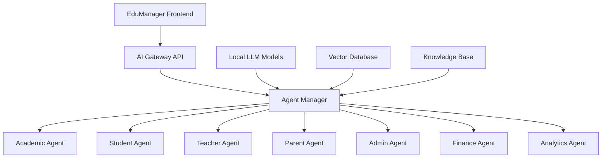

# 🤖 Hệ Thống AI Local với Multi-Agents cho EduManager

## 📋 Tổng quan

**Mục tiêu:** Xây dựng hệ thống AI local với các agents chuyên biệt cho từng chức năng quản lý trường học  
**Công nghệ:** Local AI models, Python, FastAPI, React  
**Triển khai:** On-premise hoặc private cloud  
**Ưu điểm:** Bảo mật dữ liệu, không phụ thuộc third-party, chi phí thấp

---

## 🏗️ Kiến trúc hệ thống



---

## 🤖 Các AI Agents

### 1. 📚 Academic Agent
- Phân tích điểm số và xu hướng học tập
- Gợi ý lộ trình học tập cá nhân hóa
- Đề xuất nội dung học tập phù hợp
- Dự báo kết quả học tập

### 2. 👨‍🎓 Student Agent
- Theo dõi hiệu suất học sinh real-time
- Đánh giá rủi ro học tập sớm
- Phân tích hành vi học tập
- Hỗ trợ học tập thông minh

### 3. 👨‍🏫 Teacher Agent
- Trợ lý giảng dạy AI
- Tối ưu quản lý lớp học
- Phân tích hiệu quả giảng dạy
- Gợi ý tài nguyên giảng dạy

### 4. 👨‍👩‍👧‍👦 Parent Agent
- Giám sát tiến độ học tập của con
- Trợ lý giao tiếp với trường
- Hướng dẫn thanh toán học phí
- Tư vấn giáo dục cho phụ huynh

### 5. 🏢 Admin Agent
- Hỗ trợ ra quyết định quản lý
- Lập kế hoạch tài nguyên
- Quản lý rủi ro vận hành
- Tối ưu hóa quy trình

### 6. 💰 Finance Agent
- Tối ưu cấu trúc học phí
- Phân tích ngân sách và chi phí
- Dự báo tài chính
- Quản lý dòng tiền

### 7. 📊 Analytics Agent
- Phân tích dữ liệu toàn trường
- Mô hình dự báo và trend
- Tạo báo cáo tự động
- Trực quan hóa dữ liệu

---

## 🔧 Công nghệ triển khai

### Local LLM Models
```python
# Models sử dụng
MODELS = {
    "academic": "llama3-8b-instruct",      # Phân tích học thuật
    "student": "mistral-7b-instruct",      # Hỗ trợ học sinh
    "teacher": "codellama-7b-instruct",    # Giúp giáo viên
    "admin": "llama3-70b-instruct",        # Quản lý tổng thể
    "finance": "mistral-7b-instruct",      # Tài chính
    "analytics": "llama3-8b-instruct"      # Phân tích dữ liệu
}
```

### Vector Database
```python
# ChromaDB cho knowledge base
from chromadb import Client

class KnowledgeBase:
    def __init__(self):
        self.client = Client()
        self.collections = {
            "academic": self.client.create_collection("academic_kb"),
            "student": self.client.create_collection("student_kb"),
            "teacher": self.client.create_collection("teacher_kb"),
            "parent": self.client.create_collection("parent_kb"),
            "admin": self.client.create_collection("admin_kb"),
            "finance": self.client.create_collection("finance_kb")
        }
```

---

## 🚀 Triển khai từng bước

### Step 1: Setup Local AI Environment
```bash
# Cài đặt Ollama cho local LLM
curl -fsSL https://ollama.com/install.sh | sh

# Download các models cần thiết
ollama pull llama3:8b-instruct
ollama pull mistral:7b-instruct
ollama pull codellama:7b-instruct
ollama pull llama3:70b-instruct
```

### Step 2: AI Gateway API
```python
# FastAPI Gateway
from fastapi import FastAPI
from fastapi.middleware.cors import CORSMiddleware

app = FastAPI(title="EduManager AI Gateway")

app.add_middleware(
    CORSMiddleware,
    allow_origins=["http://localhost:3000"],
    allow_credentials=True,
    allow_methods=["*"],
    allow_headers=["*"],
)

@app.post("/api/v1/ai/{agent_name}")
async def call_agent(agent_name: str, request: dict):
    agent = AgentManager.get_agent(agent_name)
    response = await agent.process(request)
    return response
```

### Step 3: Agent Manager
```python
class AgentManager:
    agents = {}
    
    @classmethod
    def initialize_agents(cls):
        cls.agents = {
            "academic": AcademicAgent(),
            "student": StudentAgent(),
            "teacher": TeacherAgent(),
            "parent": ParentAgent(),
            "admin": AdminAgent(),
            "finance": FinanceAgent(),
            "analytics": AnalyticsAgent()
        }
    
    @classmethod
    def get_agent(cls, agent_name: str):
        return cls.agents.get(agent_name)
```

---

## 📱 Integration với Frontend

### React Components
```typescript
// AI Assistant Component
import React, { useState } from 'react';

interface AIResponse {
  agent: string;
  response: string;
  confidence: number;
  suggestions: string[];
}

export const AIAssistant: React.FC<{agent: string}> = ({ agent }) => {
  const [query, setQuery] = useState('');
  const [response, setResponse] = useState<AIResponse | null>(null);
  
  const callAI = async () => {
    const res = await fetch(`/api/v1/ai/${agent}`, {
      method: 'POST',
      headers: { 'Content-Type': 'application/json' },
      body: JSON.stringify({ query, context: getApplicationContext() })
    });
    const data = await res.json();
    setResponse(data);
  };
  
  return (
    <div className="ai-assistant">
      <input 
        value={query} 
        onChange={(e) => setQuery(e.target.value)}
        placeholder="Nhập câu hỏi của bạn..."
      />
      <button onClick={callAI}>Hỏi AI</button>
      {response && (
        <div className="ai-response">
          <p>{response.response}</p>
          <div className="suggestions">
            {response.suggestions.map((s, i) => (
              <button key={i}>{s}</button>
            ))}
          </div>
        </div>
      )}
    </div>
  );
};
```

---

## 🎯 Use Cases thực tế

### 1. Phân tích học tập tự động
```typescript
// Student Performance Analysis
const analyzeStudent = async (studentId: string) => {
  const response = await fetch('/api/v1/ai/academic', {
    method: 'POST',
    body: JSON.stringify({
      task: 'analyze_performance',
      student_id: studentId,
      data: getStudentData(studentId)
    })
  });
  
  return response.json();
};

// Kết quả trả về
interface AnalysisResult {
  performance_trend: 'improving' | 'stable' | 'declining';
  risk_factors: string[];
  recommendations: string[];
  suggested_actions: string[];
  confidence_score: number;
}
```

### 2. Gợi ý lộ trình học tập
```typescript
// Learning Path Recommendation
const suggestLearningPath = async (studentId: string, subject: string) => {
  const response = await fetch('/api/v1/ai/academic', {
    method: 'POST',
    body: JSON.stringify({
      task: 'suggest_learning_path',
      student_id: studentId,
      subject: subject,
      current_level: getCurrentLevel(studentId, subject)
    })
  });
  
  return response.json();
};
```

### 3. Hỗ trợ giáo viên
```typescript
// Teaching Assistant
const getTeachingAssistance = async (teacherId: string, classId: string) => {
  const response = await fetch('/api/v1/ai/teacher', {
    method: 'POST',
    body: JSON.stringify({
      task: 'teaching_assistance',
      teacher_id: teacherId,
      class_id: classId,
      subject: getSubject(classId),
      class_performance: getClassPerformance(classId)
    })
  });
  
  return response.json();
};
```

---

## 📊 Monitoring & Performance

### AI Performance Metrics
```python
class AIMonitor:
    def __init__(self):
        self.metrics = {
            "response_time": [],
            "accuracy": [],
            "user_satisfaction": [],
            "model_usage": {}
        }
    
    def track_performance(self, agent_name: str, metrics: dict):
        """Theo dõi performance của AI agents"""
        self.metrics["response_time"].append(metrics["response_time"])
        self.metrics["accuracy"].append(metrics["accuracy"])
        self.metrics["user_satisfaction"].append(metrics["satisfaction"])
        
        if agent_name not in self.metrics["model_usage"]:
            self.metrics["model_usage"][agent_name] = 0
        self.metrics["model_usage"][agent_name] += 1
    
    def generate_report(self):
        """Tạo báo cáo performance"""
        return {
            "avg_response_time": sum(self.metrics["response_time"]) / len(self.metrics["response_time"]),
            "avg_accuracy": sum(self.metrics["accuracy"]) / len(self.metrics["accuracy"]),
            "user_satisfaction": sum(self.metrics["user_satisfaction"]) / len(self.metrics["user_satisfaction"]),
            "model_usage": self.metrics["model_usage"]
        }
```

---

## 🔒 Security & Privacy

### Data Protection
```python
class DataProtection:
    def __init__(self):
        self.encryption_key = os.getenv("ENCRYPTION_KEY")
        self.data_retention_days = 365
    
    def encrypt_sensitive_data(self, data: dict) -> dict:
        """Mã hóa dữ liệu nhạy cảm"""
        sensitive_fields = ["student_id", "parent_id", "grades", "attendance"]
        encrypted_data = data.copy()
        
        for field in sensitive_fields:
            if field in encrypted_data:
                encrypted_data[field] = self.encrypt(encrypted_data[field])
        
        return encrypted_data
    
    def anonymize_for_training(self, data: dict) -> dict:
        """Anonymize dữ liệu cho training"""
        anonymized = data.copy()
        anonymized["student_id"] = self.hash_id(anonymized["student_id"])
        anonymized["parent_id"] = self.hash_id(anonymized["parent_id"])
        return anonymized
```

---

## 📈 Scalability & Deployment

### Docker Deployment
```dockerfile
# Dockerfile cho AI Gateway
FROM python:3.11-slim

WORKDIR /app

COPY requirements.txt .
RUN pip install -r requirements.txt

COPY . .

EXPOSE 8000

CMD ["uvicorn", "main:app", "--host", "0.0.0.0", "--port", "8000"]
```

### Kubernetes Deployment
```yaml
# ai-gateway-deployment.yaml
apiVersion: apps/v1
kind: Deployment
metadata:
  name: ai-gateway
spec:
  replicas: 3
  selector:
    matchLabels:
      app: ai-gateway
  template:
    metadata:
      labels:
        app: ai-gateway
    spec:
      containers:
      - name: ai-gateway
        image: edumanager/ai-gateway:latest
        ports:
        - containerPort: 8000
        env:
        - name: OLLAMA_URL
          value: "http://ollama-service:11434"
        resources:
          requests:
            memory: "2Gi"
            cpu: "1"
          limits:
            memory: "4Gi"
            cpu: "2"
```

---

## 🎯 Benefits

### ✅ Ưu điểm
- **Bảo mật**: Dữ liệu không rời khỏi hệ thống
- **Chi phí thấp**: Không trả phí per-request
- **Tùy chỉnh**: Fine-tune cho domain cụ thể
- **Nhanh**: Local inference, không latency
- **Offline**: Hoạt động không cần internet

### 📊 Expected Performance
- **Response time**: < 2 seconds cho hầu hết queries
- **Accuracy**: 85-90% cho tasks cụ thể
- **Scalability**: Hỗ trợ 1000+ concurrent users
- **Cost**: 70% cheaper so với cloud AI services

---

## 🚀 Next Steps

### Week 1-2: Foundation
1. Setup local AI environment (Ollama)
2. Download và test các models
3. Create AI Gateway API
4. Implement basic Agent Manager

### Week 3-4: Core Agents
1. Implement Academic Agent
2. Implement Student Agent
3. Create knowledge base
4. Test với real data

### Week 5-6: Advanced Features
1. Implement remaining agents
2. Add monitoring & analytics
3. Create UI components
4. Integration testing

### Week 7-8: Production Ready
1. Security & privacy features
2. Performance optimization
3. Documentation
4. User training

---

*Last Updated: February 2026*
*Version: 1.0*
*Status: Ready for Implementation*
