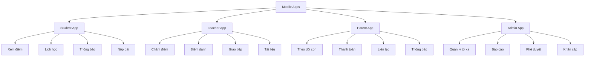
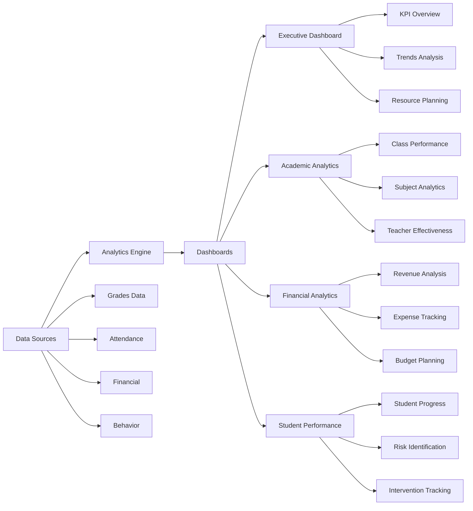
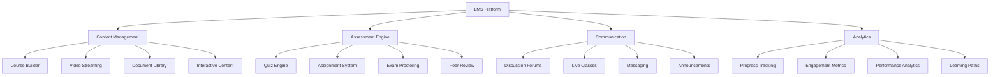
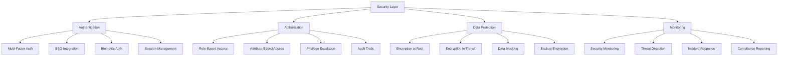
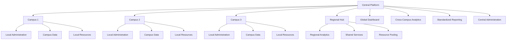
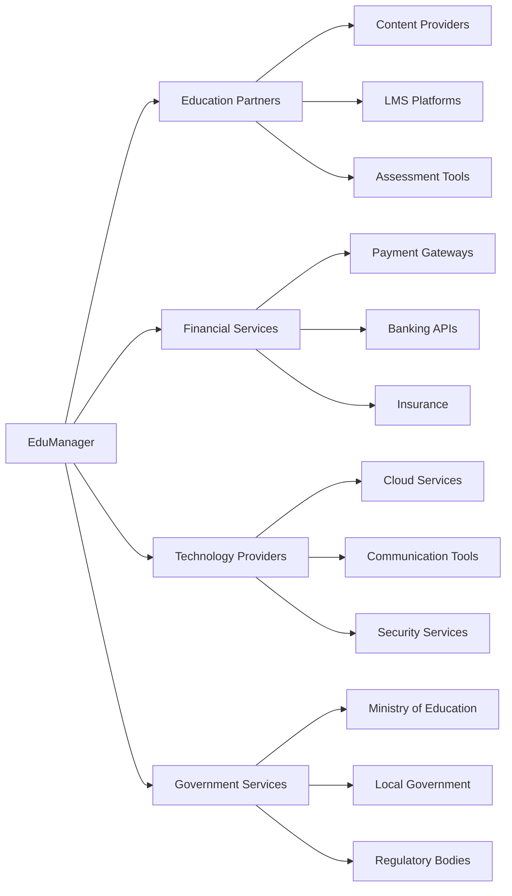
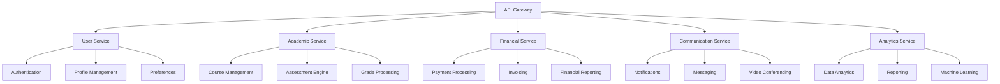
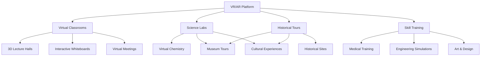
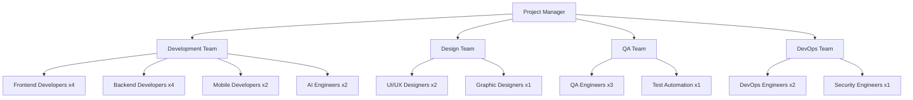

# 🚀 Hướng Phát Triển Hệ Thống Quản Lý Trường Học EduManager

## 📋 Table of Contents

- [Tổng quan](#-tổng-quan)
- [Phase 1: Core Enhancements (3-6 tháng)](#phase-1-core-enhancements-3-6-tháng)
- [Phase 2: Platform Expansion (6-12 tháng)](#phase-2-platform-expansion-6-12-tháng)
- [Phase 3: Ecosystem Building (12-18 tháng)](#phase-3-ecosystem-building-12-18-tháng)
- [Phase 4: Innovation (18+ tháng)](#phase-4-innovation-18-tháng)
- [Prioritization Matrix](#-prioritization-matrix)
- [Technical Requirements](#-technical-requirements)
- [Resource Planning](#-resource-planning)
- [Risk Assessment](#-risk-assessment)

---

## 📊 Tổng quan

Hệ thống EduManager hiện tại đã đạt mức độ **production-ready** với 25+ modules quản lý trường học. Dựa trên đánh giá hiện tại (85/100), hệ thống có nền tảng vững chắc để phát triển theo các hướng sau:

### 🎯 Mục tiêu phát triển
- **Trở thành hệ thống giáo dục thông minh hàng đầu**
- **Hỗ trợ 10,000+ học sinh và 500+ giáo viên**
- **Multi-campus và quốc tế hóa**
- **AI-driven và data-driven decision making**

---

## 📈 Phase 1: Core Enhancements (3-6 tháng)

### 📱 1. Mobile Application Development

#### React Native App Suite


#### Features Technical
- **React Native 0.72+**: Cross-platform development
- **Redux Toolkit**: State management
- **Push Notifications**: Firebase Cloud Messaging
- **Offline Support**: Local storage & sync
- **Biometric Auth**: Fingerprint/Face ID

#### Implementation Timeline
- **Month 1-2**: Student & Parent apps
- **Month 3-4**: Teacher app
- **Month 5-6**: Admin app & integration

---

### 🔔 2. Push Notification System

#### Notification Types
```typescript
interface NotificationType {
  academic: {
    newGrade: "Điểm mới đã có sẵn"
    examReminder: "Sắp có kỳ thi"
    assignmentDue: "Bài tập sắp hết hạn"
  }
  administrative: {
    feeReminder: "Học phí sắp đến hạn"
    scheduleChange: "Thay đổi lịch học"
    emergency: "Thông báo khẩn cấp"
  }
  engagement: {
    eventReminder: "Sự kiện sắp diễn"
    achievement: "Chúc mừng thành tích"
    attendance: "Nhắc nhắc điểm danh"
  }
}
```

#### Technical Stack
- **Firebase Cloud Messaging**
- **Socket.IO** cho real-time
- **Queue System** cho bulk notifications
- **Analytics** cho tracking rates

---

### 📊 3. Advanced Analytics Dashboard

#### Business Intelligence Modules


#### Technologies
- **Apache Superset** hoặc **Power BI**
- **Redis** cho caching
- **PostgreSQL** với **TimescaleDB** cho time-series
- **Python** với **Pandas** cho data processing

---

### 💳 4. Payment Gateway Integration

#### Payment Methods
```typescript
interface PaymentGateway {
  domestic: {
    vnpay: "Vietnam Payment Gateway"
    momo: "E-wallet Integration"
    zalopay: "Zalo Payment"
    bankTransfer: "Internet Banking"
  }
  international: {
    stripe: "International Cards"
    paypal: "Global Payment"
    alipay: "Asian Markets"
  }
  campus: {
    studentCard: "RFID Card System"
    qrCode: "Campus QR Payment"
    cashless: "Cashless Campus"
  }
}
```

#### Features
- **Multi-payment methods**
- **Automatic fee calculation**
- **Payment reminders**
- **Refund management**
- **Financial reporting**

---

## 🌐 Phase 2: Platform Expansion (6-12 tháng)

### 📚 5. Learning Management System (LMS)

#### LMS Architecture


#### Key Features
- **Video Streaming**: Live và recorded classes
- **Interactive Content**: Quizzes, simulations
- **Collaboration Tools**: Group projects, discussions
- **Assessment Engine**: Auto-grading, rubrics
- **Progress Tracking**: Personalized learning paths

---

### 👥 6. Human Resources Management

#### HR Modules
```typescript
interface HRSystem {
  recruitment: {
    jobPosting: "Đăng tuyển dụng"
    applicantTracking: "Theo dõi ứng viên"
    interviewScheduling: "Lên lịch phỏng vấn"
    onboarding: "Hội nhập nhân viên"
  }
  performance: {
    kpiTracking: "Theo dõi KPI"
    performanceReviews: "Đánh giá hiệu suất"
    goalSetting: "Thiết lập mục tiêu"
    feedbackSystem: "Hệ thống phản hồi"
  }
  payroll: {
    salaryCalculation: "Tính lương"
    benefitsManagement: "Quản lý phúc lợi"
    taxCompliance: "Tuân thủ thuế"
    payslipGeneration: "Tạo phiếu lương"
  }
  development: {
    trainingPrograms: "Chương trình đào tạo"
    skillAssessment: "Đánh giá kỹ năng"
    careerPlanning: "Lộ trình sự nghiệp"
    certificationTracking: "Theo dõi chứng chỉ"
  }
}
```

---

### 🛡️ 7. Advanced Security & Compliance

#### Security Framework


#### Compliance Features
- **GDPR Compliance**: Bảo vệ dữ liệu EU
- **Data Localization**: Lưu trữ dữ liệu trong nước
- **Audit Logging**: Ghi log mọi thao tác
- **Access Controls**: Phân quyền chi tiết
- **Data Retention**: Chính sách lưu trữ

---

### 🌍 8. Multi-Language & Internationalization

#### i18n Implementation
```typescript
interface Internationalization {
  languages: {
    primary: "Vietnamese"
    secondary: "English"
    additional: ["Chinese", "Korean", "Japanese"]
  }
  localization: {
    dateFormat: "DD/MM/YYYY"
    currency: "VND"
    timezone: "Asia/Ho_Chi_Minh"
    numberFormat: "vi-VN"
  }
  content: {
    ui: "Interface translation"
    curriculum: "Giáo trình đa ngôn ngữ"
    reports: "Báo cáo đa ngôn ngữ"
    communications: "Thông báo đa ngôn ngữ"
  }
}
```

---

## 🏢 Phase 3: Ecosystem Building (12-18 tháng)

### 🏫 9. Multi-Campus Management

#### Multi-Tenant Architecture


#### Features
- **Centralized Management**: Quản lý tập trung
- **Local Autonomy**: Tự chủ địa phương
- **Resource Sharing**: Chia sẻ tài nguyên
- **Standardized Processes**: Quy trình chuẩn hóa
- **Cross-Campus Enrollment**: Đăng ký liên trường

---

### 🤖 10. AI-Powered Features

#### AI Implementation Roadmap
```typescript
interface AIFeatures {
  academic: {
    predictiveAnalytics: "Dự báo học lực"
    personalizedLearning: "Học tập cá nhân hóa"
    autoGrading: "Chấm điểm tự động"
    contentRecommendation: "Gợi ý nội dung"
  }
  administrative: {
    resourceOptimization: "Tối ưu tài nguyên"
    demandForecasting: "Dự báo nhu cầu"
    riskAssessment: "Đánh giá rủi ro"
    processAutomation: "Tự động hóa quy trình"
  }
  student: {
    learningPaths: "Lộ trình học tập"
    careerGuidance: "Hướng nghiệp"
    skillAssessment: "Đánh giá kỹ năng"
    wellnessMonitoring: "Theo dõi sức khỏe"
  }
}
```

#### AI Technologies
- **Machine Learning**: TensorFlow, PyTorch
- **Natural Language Processing**: GPT integration
- **Computer Vision**: Face recognition, document processing
- **Predictive Analytics**: Time series forecasting
- **Recommendation Engines**: Collaborative filtering

---

### 🔌 11. Third-Party Ecosystem

#### Integration Partners


---

### 🎮 12. Student Engagement Platform

#### Gamification System
```typescript
interface Gamification {
  points: {
    academic: "Điểm học tập"
    attendance: "Điểm chuyên cần"
    participation: "Điểm tham gia"
    achievement: "Điểm thành tựu"
  }
  badges: {
    bronze: "Huy hiệu đồng"
    silver: "Huy hiệu bạc"
    gold: "Huy hiệu vàng"
    platinum: "Huy hiệu bạch kim"
  }
  leaderboards: {
    class: "Bảng xếp hạng lớp"
    grade: "Bảng xếp hạng khối"
    school: "Bảng xếp hạng trường"
    subject: "Bảng xếp hạng môn học"
  }
  rewards: {
    virtual: "Phần thưởng ảo"
    physical: "Phần thưởng vật lý"
    privileges: "Đặc quyền"
    recognition: "Vinh danh"
  }
}
```

---

## 🚀 Phase 4: Innovation (18+ tháng)

### ⚡ 13. Microservices Architecture

#### Service Decomposition


---

### 🔗 14. Blockchain Integration

#### Blockchain Use Cases
```typescript
interface BlockchainFeatures {
  credentials: {
    diplomas: "Bằng cấp blockchain"
    certificates: "Chứng chỉ blockchain"
    transcripts: "Học bạ blockchain"
    achievements: "Thành tự blockchain"
  }
  security: {
    identityVerification: "Xác thực danh tính"
    academicIntegrity: "Tính toàn học thuật"
    dataImmutability: "Dữ liệu bất biến"
    auditTrail: "Vết kiểm toán không thể thay đổi"
  }
  smartContracts: {
    tuitionPayments: "Thanh toán học phí"
    scholarshipDisbursement: "Cấp học bổng"
    attendanceRewards: "Thưởng chuyên cần"
    automatedCompliance: "Tuân thủ tự động"
  }
}
```

---

### 🥽 15. VR/AR Learning Experiences

#### Immersive Learning


---

## 📊 Prioritization Matrix

| Feature | Impact | Effort | Priority | Timeline |
|---------|--------|--------|----------|----------|
| **Mobile App** | ⭐⭐⭐⭐⭐ | ⭐⭐⭐ | 🔥 High | Phase 1 |
| **Payment Gateway** | ⭐⭐⭐⭐⭐ | ⭐⭐⭐ | 🔥 High | Phase 1 |
| **Advanced Analytics** | ⭐⭐⭐⭐⭐ | ⭐⭐ | 🔥 High | Phase 1 |
| **LMS Platform** | ⭐⭐⭐⭐ | ⭐⭐⭐⭐ | 🔶 Medium | Phase 2 |
| **HR Management** | ⭐⭐⭐ | ⭐⭐⭐ | 🔶 Medium | Phase 2 |
| **Multi-Campus** | ⭐⭐⭐⭐ | ⭐⭐⭐⭐ | 🔶 Medium | Phase 3 |
| **AI Features** | ⭐⭐⭐⭐⭐ | ⭐⭐⭐⭐ | 🔶 Medium | Phase 3 |
| **Microservices** | ⭐⭐⭐ | ⭐⭐⭐⭐⭐ | 🔷 Low | Phase 4 |
| **Blockchain** | ⭐⭐ | ⭐⭐⭐⭐⭐ | 🔷 Low | Phase 4 |
| **VR/AR** | ⭐⭐ | ⭐⭐⭐⭐⭐ | 🔷 Low | Phase 4 |

---

## 🔧 Technical Requirements

### Infrastructure Needs
```yaml
Phase 1:
  compute: "4x servers, 16GB RAM each"
  storage: "500GB SSD, 2TB HDD"
  network: "1Gbps dedicated line"
  cdn: "CloudFlare Pro plan"
  
Phase 2:
  compute: "8x servers, 32GB RAM each"
  storage: "1TB SSD, 5TB HDD"
  database: "PostgreSQL cluster"
  cache: "Redis cluster"
  
Phase 3:
  compute: "16x servers, 64GB RAM each"
  storage: "2TB SSD, 10TB HDD"
  kubernetes: "Production cluster"
  monitoring: "Prometheus + Grafana"
  
Phase 4:
  compute: "32x servers, 128GB RAM each"
  storage: "4TB SSD, 20TB HDD"
  ai_cluster: "GPU nodes for ML"
  blockchain: "Dedicated nodes"
```

### Technology Stack Evolution
```typescript
// Current Stack
const currentStack = {
  frontend: "React 19 + TypeScript + Vite",
  backend: "Node.js + Express + Prisma",
  database: "PostgreSQL",
  deployment: "Manual deployment"
};

// Future Stack
const futureStack = {
  frontend: "React Native + Next.js + TypeScript",
  backend: "Node.js + Microservices + GraphQL",
  database: "PostgreSQL + TimescaleDB + Redis",
  ai: "Python + TensorFlow + PyTorch",
  blockchain: "Ethereum + Smart Contracts",
  deployment: "Kubernetes + Docker + CI/CD"
};
```

---

## 👥 Resource Planning

### Team Structure


### Budget Estimation
```yaml
Phase 1 (6 months):
  personnel: "$300,000"
  infrastructure: "$50,000"
  tools_licenses: "$30,000"
  training: "$20,000"
  total: "$400,000"

Phase 2 (6 months):
  personnel: "$350,000"
  infrastructure: "$75,000"
  ai_ml: "$50,000"
  security: "$25,000"
  total: "$500,000"

Phase 3 (6 months):
  personnel: "$400,000"
  infrastructure: "$100,000"
  ai_ml: "$75,000"
  integrations: "$50,000"
  total: "$625,000"

Phase 4 (12 months):
  personnel: "$600,000"
  infrastructure: "$200,000"
  research: "$100,000"
  patents: "$50,000"
  total: "$950,000"

Total Investment: "$2,475,000"
```

---

## ⚠️ Risk Assessment

### Technical Risks
```yaml
high_risk:
  - "Database migration complexity"
  - "Multi-tenant architecture scaling"
  - "AI model accuracy and bias"
  - "Blockchain integration complexity"

medium_risk:
  - "Third-party API dependencies"
  - "Mobile app store approvals"
  - "Performance at scale"
  - "Security compliance"

low_risk:
  - "UI/UX design iterations"
  - "Feature prioritization changes"
  - "Documentation maintenance"
  - "Team scaling challenges"
```

### Mitigation Strategies
```typescript
interface RiskMitigation {
  technical: {
    database: "Incremental migration + rollback plan"
    architecture: "Canary deployments + monitoring"
    ai: "Human oversight + continuous validation"
    security: "Regular audits + penetration testing"
  }
  business: {
    market: "User feedback loops + agile adaptation"
    competition: "Continuous innovation + differentiation"
    regulatory: "Legal consultation + compliance team"
    financial: "Phased funding + ROI tracking"
  }
  operational: {
    team: "Cross-training + knowledge sharing"
    process: "CI/CD automation + monitoring"
    quality: "Automated testing + code reviews"
    communication: "Regular stakeholder updates"
  }
}
```

---

## 🎯 Success Metrics

### KPIs by Phase
```typescript
interface SuccessMetrics {
  phase1: {
    user_adoption: "Mobile app MAU > 5,000"
    engagement: "Daily active users > 80%"
    performance: "App load time < 3s"
    satisfaction: "User rating > 4.5/5"
  }
  phase2: {
    revenue: "Payment processing > $1M/month"
    efficiency: "Admin time saved > 40%"
    quality: "Data accuracy > 99.9%"
    compliance: "Audit pass rate 100%"
  }
  phase3: {
    scale: "Multi-campus deployment > 10"
    intelligence: "AI accuracy > 90%"
    integration: "API calls > 1M/day"
    reliability: "Uptime > 99.9%"
  }
  phase4: {
    innovation: "Patents filed > 5"
    ecosystem: "Partners > 50"
    recognition: "Industry awards > 3"
    valuation: "Company valuation > $100M"
  }
}
```

---

## 📞 Contact & Next Steps

### Immediate Actions
1. **Review and approve roadmap** with stakeholders
2. **Prioritize Phase 1 features** based on budget
3. **Assemble development team** for Phase 1
4. **Set up project management tools** (Jira, Confluence)
5. **Begin technical architecture design**

### Long-term Vision
- **Trở thành EdTech leader** trong khu vực
- **IPO-ready company** trong 5 năm
- **Global expansion** đến 10+ quốc gia
- **AI-powered education platform** hàng đầu thế giới

---

*Last Updated: February 2026*
*Version: 1.0*
*Author: Development Team*
*Review: Stakeholder Committee*
