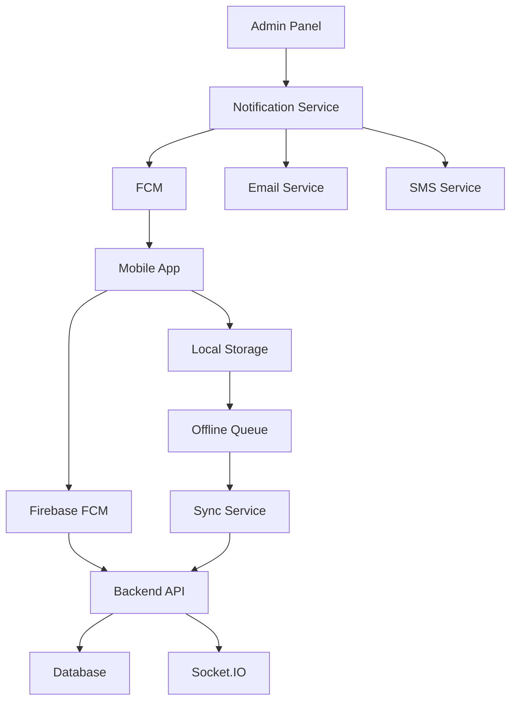
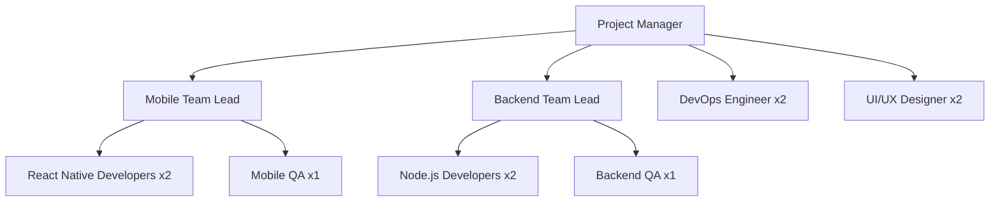

# 🚀 Kế Hoạch Thực Hiện Phase 1: Core Enhancements (3-6 tháng)

## 📋 Tổng quan

**Thời gian thực hiện:** 3-6 tháng  
**Mục tiêu:** Xây dựng nền tảng mobile, analytics, payment gateway  
**Team cần:** 8-12 người (4 frontend, 4 backend, 2 mobile, 2 DevOps)  
**Ngân sách dự kiến:** $400,000

---

## 🗓️ Week 1-2: Foundation Setup

### 📅 Week 1: Environment & Infrastructure

#### ✅ Tasks Checklist
- [ ] **Setup development environment**
  - Create development repositories
  - Setup Git workflow with branching strategy
  - Install required tools (Node.js, React Native CLI, etc.)
  - Configure IDEs and extensions

- [ ] **Infrastructure preparation**
  - Setup staging environment
  - Configure CI/CD pipeline (GitHub Actions)
  - Setup monitoring tools (Sentry, LogRocket)
  - Prepare cloud services (AWS/Azure)

#### 🛠️ Technical Tasks
```bash
# Repository setup
git clone <repository-url>
cd edumanager-mobile
git checkout -b feature/mobile-app

# Install React Native CLI
npm install -g react-native-cli
npx react-native init EduManagerMobile --template react-native-template-typescript

# Backend API setup
cd ../backend
npm install express-validator cors helmet morgan
npm install --save-dev @types/express @types/cors
```

---

### 📱 Week 2: Project Architecture

#### ✅ Tasks Checklist
- [ ] **Mobile app architecture**
  - Setup folder structure
  - Configure navigation (React Navigation)
  - Setup state management (Redux Toolkit)
  - Configure API client (Axios)

- [ ] **Backend enhancements**
  - Create mobile-specific API endpoints
  - Setup authentication middleware for mobile
  - Configure CORS for mobile apps
  - Create API documentation

#### 🛠️ Technical Tasks
```typescript
// Mobile app structure
src/
├── components/
│   ├── common/
│   ├── Button/
│   ├── Input/
│   └── Loading/
├── screens/
│   ├── auth/
│   ├── student/
│   ├── teacher/
│   └── parent/
├── navigation/
├── services/
│   ├── api/
│   ├── auth/
│   └── storage/
├── store/
│   ├── slices/
│   └── index.ts
└── utils/
```

---

## 📱 Month 1-2: Student & Parent Apps

### 📅 Week 3-4: Student App Core Features

#### ✅ Tasks Checklist
- [ ] **Authentication system**
  - Login/Logout functionality
  - Biometric authentication (Face ID/Fingerprint)
  - Token management (JWT)
  - Session persistence

- [ ] **Core screens**
  - Dashboard/Home screen
  - Profile management
  - Settings & preferences
  - Navigation structure

#### 📱 Week 5-6: Student App Academic Features

#### ✅ Tasks Checklist
- [ ] **Academic features**
  - View grades & transcripts
  - View class schedule
  - View assignments
  - View attendance records

- [ ] **Communication**
  - Receive notifications
  - View announcements
  - Contact teachers
  - Join video classes

#### 📱 Week 7-8: Parent App Core Features

#### ✅ Tasks Checklist
- [ ] **Authentication & Profile**
  - Parent login system
  - Student linking
  - Profile management
  - Security settings

- [ ] **Child monitoring**
  - View child's grades
  - View attendance
  - View schedule
  - Receive notifications

#### 📱 Week 9-10: Parent App Financial Features

#### ✅ Tasks Checklist
- [ ] **Payment system**
  - View fee structure
  - Make payments
  - Payment history
  - Auto-payment setup

- [ ] **Communication**
  - Teacher messaging
  - School announcements
  - Event notifications
  - Emergency alerts

---

## 📱 Month 3-4: Teacher App

### 📅 Week 11-12: Teacher App Core Features

#### ✅ Tasks Checklist
- [ ] **Teacher authentication**
  - Login system
  - Role-based access
  - Security features
  - Profile management

- [ ] **Class management**
  - View class list
  - Student information
  - Schedule management
  - Attendance tracking

#### 📱 Week 13-14: Teacher App Academic Features

#### ✅ Tasks Checklist
- [ ] **Grade management**
  - Enter grades
  - View grade analytics
  - Bulk grading tools
  - Grade export

- [ ] **Communication**
  - Send announcements
  - Message parents
  - Schedule video calls
  - Share resources

#### 📱 Week 15-16: Teacher App Advanced Features

#### ✅ Tasks Checklist
- [ ] **Assessment tools**
  - Create assignments
  - Create quizzes
  - Grade submissions
  - Provide feedback

- [ ] **Analytics**
  - Class performance
  - Student progress
  - Teaching insights
  - Export reports

---

## 📱 Month 5-6: Admin App & Integration

### 📅 Week 17-18: Admin App Core Features

#### ✅ Tasks Checklist
- [ ] **Admin authentication**
  - Multi-factor authentication
  - Role-based permissions
  - Audit logging
  - Security monitoring

- [ ] **Dashboard**
  - System overview
  - Key metrics
  - Alerts & notifications
  - Quick actions

#### 📱 Week 19-20: Admin App Management Features

#### ✅ Tasks Checklist
- [ ] **User management**
  - Manage users
  - Role assignments
  - Permission settings
  - Bulk operations

- [ ] **System configuration**
  - School settings
  - Academic calendar
  - Fee structure
  - System policies

#### 📱 Week 21-22: Integration & Testing

#### ✅ Tasks Checklist
- [ ] **API integration**
  - Connect mobile apps to backend
  - Test all API endpoints
  - Error handling
  - Performance optimization

- [ ] **Testing & QA**
  - Unit testing
  - Integration testing
  - User acceptance testing
  - Performance testing

---

## 🔧 Technical Implementation Details

### 📱 Mobile App Technology Stack

```json
{
  "framework": "React Native 0.72+",
  "language": "TypeScript",
  "stateManagement": "Redux Toolkit",
  "navigation": "React Navigation 6",
  "ui": "React Native Elements",
  "icons": "React Native Vector Icons",
  "animations": "React Native Reanimated",
  "testing": "Jest + React Native Testing Library"
}
```

### 🛠️ Backend Enhancements

```typescript
// New API endpoints for mobile
interface MobileAPIRoutes {
  auth: {
    login: "/api/v1/mobile/auth/login",
    logout: "/api/v1/mobile/auth/logout",
    refresh: "/api/v1/mobile/auth/refresh",
    biometric: "/api/v1/mobile/auth/biometric"
  }
  notifications: {
    register: "/api/v1/mobile/notifications/register",
    send: "/api/v1/mobile/notifications/send",
    history: "/api/v1/mobile/notifications/history"
  }
  payments: {
    methods: "/api/v1/mobile/payments/methods",
    process: "/api/v1/mobile/payments/process",
    history: "/api/v1/mobile/payments/history"
  }
}
```

### 🔔 Notification System Architecture



---

## 📊 Progress Tracking

### 📈 Week-by-Week Progress

| Week | Focus Area | Key Deliverables | Status |
|------|------------|----------------|--------|
| 1-2 | Foundation | Environment setup, architecture | ⏳️ Planned |
| 3-4 | Student App | Auth, core screens | ⏳️ Planned |
| 5-6 | Student App | Academic features | ⏳️ Planned |
| 7-8 | Parent App | Auth, monitoring | ⏳️ Planned |
| 9-10 | Parent App | Financial features | ⏳️ Planned |
| 11-12 | Teacher App | Auth, class management | ⏳️ Planned |
| 13-14 | Teacher App | Academic features | ⏳️ Planned |
| 15-16 | Teacher App | Advanced features | ⏳️ Planned |
| 17-18 | Admin App | Auth, dashboard | ⏳️ Planned |
| 19-20 | Admin App | Management features | ⏳️ Planned |
| 21-22 | Integration | API testing, QA | ⏳️ Planned |

### 🎯 Milestones

#### 🚀 Milestone 1: Foundation (Week 1-2)
- ✅ Development environment ready
- ✅ Architecture designed
- ✅ CI/CD pipeline configured
- ✅ Team assembled

#### 📱 Milestone 2: Student App (Week 3-10)
- ✅ Student app fully functional
- ✅ Core academic features implemented
- ✅ Testing completed

#### 👨 Milestone 3: Parent App (Week 7-10)
- ✅ Parent app fully functional
- ✅ Financial features implemented
- ✅ Testing completed

#### 👨‍🏫 Milestone 4: Teacher App (Week 11-16)
- ✅ Teacher app fully functional
- ✅ Advanced features implemented
- ✅ Testing completed

#### 🏢 Milestone 5: Admin App (Week 17-22)
- ✅ Admin app fully functional
- ✅ Integration completed
- ✅ Production ready

---

## 🛠️ Required Resources

### 👥 Team Structure



### 📦 Technology Stack

#### Frontend (Mobile)
- React Native CLI
- TypeScript
- Redux Toolkit
- React Navigation
- Firebase Cloud Messaging

#### Backend
- Node.js + Express
- TypeScript
- PostgreSQL
- Redis
- Socket.IO

#### Infrastructure
- AWS/Azure
- Docker
- Kubernetes
- GitHub Actions
- Sentry (Monitoring)

---

## ⚠️ Risk Mitigation

### 🚨 Technical Risks
- **Performance**: Optimize bundle size, implement lazy loading
- **Security**: Implement proper authentication, data encryption
- **Compatibility**: Test on multiple devices and OS versions
- **Scalability**: Design for 10,000+ concurrent users

### 📋 Business Risks
- **Timeline**: Buffer time for unexpected delays
- **Budget**: Allocate contingency fund (15%)
- **Adoption**: Plan user onboarding and training
- **Competition**: Monitor market trends and adapt

---

## 🎯 Success Metrics

### 📱 Phase 1 KPIs
- **User Adoption**: 5,000+ MAU within 6 months
- **Engagement**: 80% daily active users
- **Performance**: App load time < 3 seconds
- **Satisfaction**: User rating > 4.5/5 stars
- **Reliability**: 99.9% uptime
- **Security**: Zero major security incidents

### 📊 Tracking Metrics
```typescript
interface Phase1Metrics {
  development: {
    velocity: "Story points per sprint"
    quality: "Bug density, test coverage"
    timeline: "On-time delivery rate"
  }
  product: {
    adoption: "MAU, DAU, retention"
    engagement: "Session duration, feature usage"
    performance: "Load time, crash rate"
    satisfaction: "App store ratings, feedback"
  }
  business: {
    revenue: "Payment processing volume"
    efficiency: "Time saved for users"
    growth: "User acquisition cost"
  }
}
```

---

## 📞 Next Steps

### 🚀 Immediate Actions (This Week)
1. **Review and approve** Phase 1 plan with stakeholders
2. **Assemble development team** based on structure above
3. **Setup development environment** and tools
4. **Create project repositories** and branching strategy
5. **Begin Week 1 tasks**: Environment setup and architecture

### 📅 Short-term (Month 1)
1. **Complete foundation setup**
2. **Start Student App development**
3. **Implement core features**
4. **Begin testing pipeline**

### 🎯 Medium-term (3-6 months)
1. **Complete all mobile apps**
2. **Integrate with existing system**
3. **Deploy to production**
4. **Begin Phase 2 planning**

---

## 📞 Contact & Support

### 📧 Project Management
- **Daily standups**: 9:00 AM daily
- **Weekly reviews**: Friday 4:00 PM
- **Sprint planning**: Bi-weekly
- **Stakeholder updates**: Monthly

### 🤝 Technical Support
- **Documentation**: Comprehensive API docs
- **Training**: Team onboarding and skill development
- **Tools**: Issue tracking, version control
- **Monitoring**: 24/7 system monitoring

---

*Last Updated: February 2026*
*Version: 1.0*
*Phase: Phase 1 Planning*
*Status: Ready for Implementation*
